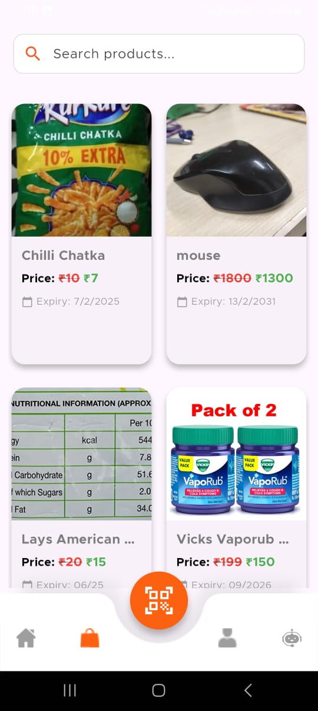

# Product Pulse

## Hold the Pulse of Your Products

### Overview
Product Pulse is a mobile application designed to help consumers track the expiry dates of their products, reducing waste and promoting smarter shopping habits. 

### Problem Statement
Consumers often:
- Buy ingredients without meal planning, leading to forgotten and expired food.
- Overbuy and forget about items, wasting money.
- Have no easy way to scan and track expiry dates.
- Consume expired food, medicines, or cosmetics, leading to health risks.

### Key Features
✅ Expiry Date Tracking – Get notified before your products expire.
✅ Polling System – Consumers can create polls for near-expiry products.
✅ OCR Integration – Scan product labels to automatically input expiry details.
✅ Smart Shopping – Avoid unnecessary purchases and minimize waste.
✅ Compliance & Safety – Ensure health and legal compliance by avoiding expired products.

### Tech Stack
- **Flutter** – Cross-platform app development.
- **MongoDB** – Database for managing product information.
- **Firebase/Cloudinary** – Cloud services for backend and storage.

### Target Users
- **Consumers**: Busy individuals who need a quick and efficient way to track product expiry.
- **Admins**: Responsible for enhancing productivity and application efficiency.

### Comparison with Existing Systems
| Feature | Expiration Reminder | Expiry Wiz | Best Before | Product Pulse |
|---------|----------------------|-----------|-------------|---------------|
| Camera Scan | No | Yes | No | Yes |
| OCR Mechanism | No | No | No | Yes |
| Shopping List Integration | No | No | Yes | Yes |
| Expiry Notifications | Yes | Yes | No | Yes |

### Business Model
- **Subscription-based model** for premium expiry tracking services.
- **Partnerships with retailers** to integrate expiry tracking into shopping apps.
- **Advertisement revenue** from food brands promoting their fresh products.

### Screenshots

#### Splash & Welcome Screens
<p align="center">
  
  
  
  
</p>

#### Authentication Screens
<p align="center">
  
  
</p>

#### Home & Product Screen
<p align="center">
  
  
  
  
</p>

#### Profile & Chat Screens
<p align="center">
  
  
  
</p>

### Conclusion
🚀 Never eat, take, or apply expired products again!
💰 Save money, reduce waste & protect your health.
🤝 Join us in making expiry tracking effortless for everyone.

## Installation
1. Clone the repository:
   ```sh
   git clone https://github.com/your-repo/product-pulse.git
   ```
2. Navigate to the project directory:
   ```sh
   cd product-pulse
   ```
3. Install dependencies:
   ```sh
   flutter pub get
   ```
4. Run the app:
   ```sh
   flutter run
   ```

## Contributors
- [**Saurav Kumar Singh**](https://github.com/sauravksingh) - Developer
- [**Prashant**](https://github.com/prashant19092004) - Developer
---
🌟 *Hold the Pulse of Your Products!* 🌟

